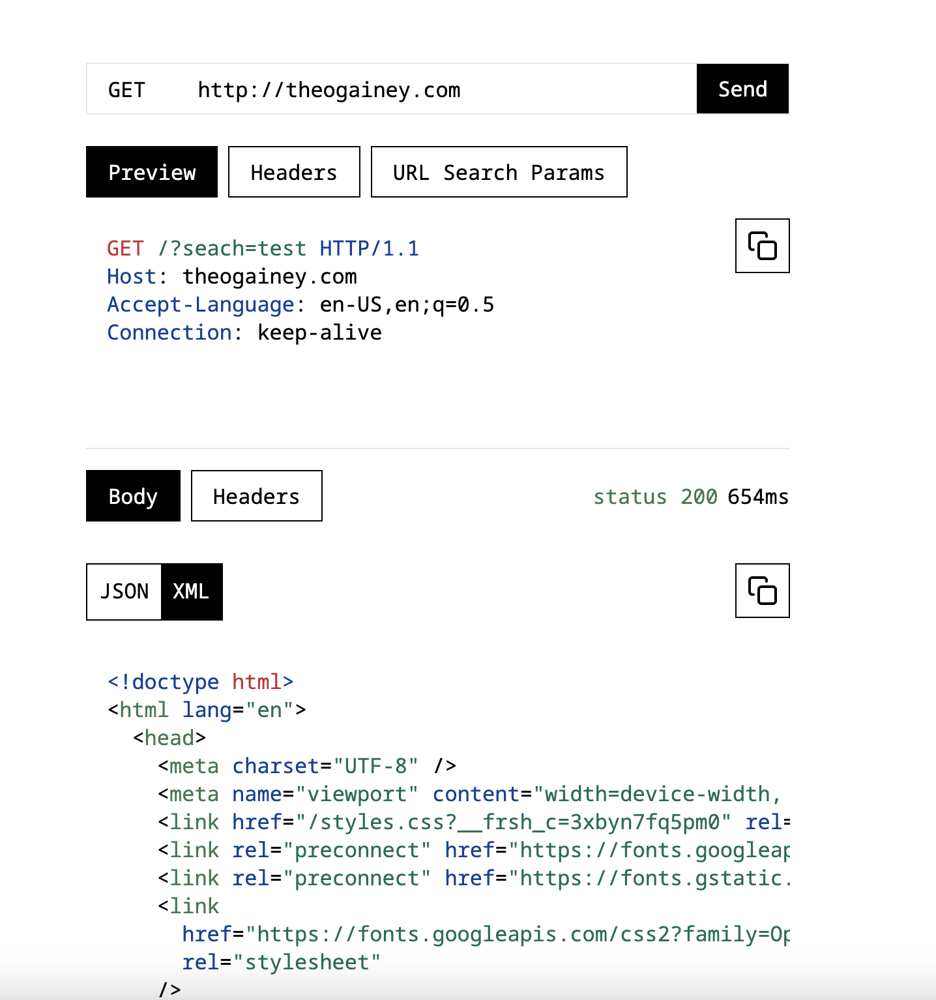
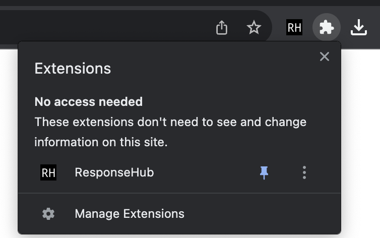

# ResponseHub (Coming soon!)

Send HTTP requests and inspect the responses without leaving the browser.   

## Why ResponseHub

There are many powerful tools for API testing, such as Postman. However, nearly all these tools either have fewer features in their browser version or require you to leave the browser to use them. If you are developing for the browser, wouldn't it be more convenient to send HTTP requests and inspect the responses without leaving the browser? ResponseHub aims to do just that by bringing a full-featured API testing platform with a modern and user-friendly UI to the browser. 



## Getting Started

At this moment the only way to run ResponseHub is locally. It is currently planned to release the ResponseHub browser extension to the Chrome Web Store and to the App Store soon.  

### Running Locally

After cloning the repository, run the following commands:

```
# Install dependencies
npm install

# Start development server
npm run dev
```
Next, load the extension into your browser. The built browser extension is located in the directory `./extension`. Currently, this built extension will only work correctly in Chrome, and possibly firefox. See [Chrome Developer docs](https://developer.chrome.com/docs/extensions/get-started/tutorial/hello-world#load-unpacked) for instructions on how to load the unpacked extension. When the extension is loaded, the ResponseHub extension should appear in the extensions menu 



While the development server is running, the extension will rebuild on any changes to a file in the directory `./src`. Once the extension is loaded into your browser all that is needed for any changes to appear is to either reload or relaunch the browser extension. 

